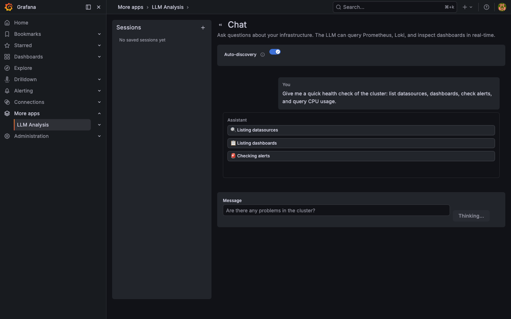
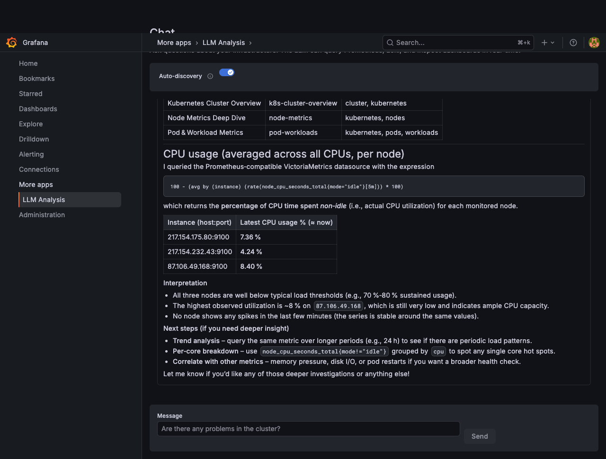

# Grafana LLM Analysis Plugin

A Grafana app plugin that connects any OpenAI-compatible LLM to your Grafana instance.
Chat with your infrastructure — the LLM queries Prometheus, Loki, Alertmanager, and
dashboards in real-time via tool calling to provide data-backed analysis.

## Features

### 💬 Chat
Open-ended chat with full tool-calling access. The LLM can query your Prometheus
metrics, search Loki logs, list alerts, and inspect dashboards — all automatically.

- **Auto-discovery** — LLM discovers datasources and dashboards on its own
- **Manual context** — Pin specific datasources and dashboards for focused queries
- **Quick actions** — One-click "Find Anomalies", "Cluster Health", "Alert Investigation"
- **Session persistence** — Conversations saved in Grafana's database, resumable anytime
- **Multi-turn** — Full conversation context preserved across messages
- **Token tracking** — Real-time context size indicator with configurable limit

### 📊 Chat with Dashboard
Select any dashboard and ask questions about it. The plugin extracts panels, queries,
and variables, then the LLM queries live data.

- **Explain Dashboard** — Structured walkthrough of every panel and metric
- **Find Anomalies** — LLM queries actual data and flags deviations
- **Session sidebar** — Manage and resume dashboard conversations

### 🔍 Analysis Modes
Right-click any panel → "Analyze with LLM" for quick analysis.

- **Explain Panel** — What the data shows, notable patterns, concerns
- **Summarize Dashboard** — Purpose, key metrics, current state
- **Analyze Logs** — Pattern detection, error categorization, root causes
- **Analyze Metrics** — Trend analysis, anomaly detection, recommendations

### 🔧 LLM Tool Calling (7 tools)
The LLM has access to your infrastructure via these tools:

| Tool | Description |
|------|-------------|
| `query_prometheus` | Execute PromQL queries against Prometheus/VictoriaMetrics |
| `query_loki` | Execute LogQL queries against Loki |
| `list_datasources` | Discover configured datasources |
| `list_dashboards` | Search and list dashboards |
| `get_dashboard` | Inspect dashboard panels, queries, variables |
| `list_alerts` | Check firing/pending alerts from Alertmanager |
| `list_alert_rules` | Inspect configured alert rules and expressions |

Tool call badges show queries being executed in real-time, with a **copy button** to
reuse generated PromQL/LogQL in your own dashboards.

### ✨ Other Features
- **Streaming responses** — Real-time token-by-token output
- **Markdown rendering** — Tables, code blocks, headers, lists, HTML
- **Panel menu integration** — "Analyze with LLM" in every panel's context menu
- **Any OpenAI-compatible API** — OpenAI, Azure OpenAI, Ollama, vLLM, LiteLLM, etc.
- **Session export/import** — Download conversations as JSON

## Screenshots

### Chat — Cluster Health with Live Tool Calling



### Chat with Dashboard — Explain Dashboard


### Dashboard Chat — Select & Quick Actions


### Chat Page — Sessions & Quick Actions



## Requirements

- Grafana ≥ 10.0.0
- An OpenAI-compatible LLM endpoint (with tool calling support recommended)

## Installation

### From source

```bash
git clone https://github.com/tamcore/grafana-llmanalysis-app.git
cd tamcore-llmanalysis-app

npm install
npm run build

go build -o dist/gpx_llmanalysis ./pkg/

cp -r dist/ /var/lib/grafana/plugins/tamcore-llmanalysis-app/
```

### Docker (development)

```bash
npm install && npm run build
go build -o dist/gpx_llmanalysis ./pkg/
docker compose up
```

Open Grafana at http://localhost:3000 (admin/admin).

### Kubernetes (plain manifests)

Example manifests are in `deploy/`. Update `ingress.yaml` and
`provisioning-datasources.yaml` for your environment.

### Kubernetes (grafana-operator)

If you use the [grafana-operator](https://github.com/grafana/grafana-operator),
see [docs/grafana-operator.md](docs/grafana-operator.md) for a complete deployment
guide using `Grafana`, `GrafanaDatasource`, and `GrafanaDashboard` CRDs.

## Configuration

1. Go to **Administration → Plugins → LLM Analysis**
2. Click **Configuration**
3. Set:
   - **Endpoint URL** — Base URL of your LLM API (e.g., `https://api.openai.com/v1`)
   - **Model** — Model name (e.g., `gpt-4o`)
   - **API Key** — Your API key (stored securely in Grafana)
   - **Grafana Service Account Token** — Required for tool calling. Set `grafanaTokenPath` (recommended for K8s — reads token from a mounted secret file) or `grafanaToken` in secureJsonData (static token). Create a Viewer service account under Administration → Service Accounts.
   - **Timeout** — Request timeout in seconds (default: 60)
   - **Max Tokens** — Maximum response tokens (default: 4096)
   - **Max Context Tokens** — Context window limit for token tracking (e.g., 120000)
4. Click **Test Connection** to verify
5. Click **Save settings**

## Supported Providers

Any endpoint that implements the OpenAI `POST /v1/chat/completions` API works.
Tool calling support is recommended for full functionality.

| Provider           | Base URL Example                                      | Auth        |
| ------------------ | ----------------------------------------------------- | ----------- |
| OpenAI             | `https://api.openai.com/v1`                           | Bearer      |
| Azure OpenAI       | `https://{resource}.openai.azure.com/openai/...`      | API key     |
| Ollama             | `http://localhost:11434/v1`                            | None        |
| vLLM               | `http://localhost:8000/v1`                             | Bearer      |
| LiteLLM            | `http://localhost:4000/v1`                             | Bearer      |

## API Endpoints

| Endpoint           | Method | Description                          |
| ------------------ | ------ | ------------------------------------ |
| `/resources/health`| GET    | Test LLM endpoint connectivity       |
| `/resources/chat`  | POST   | Non-streaming chat completion        |
| `/resources/chat/stream` | POST | Streaming chat with tool calling |

## Development

```bash
# Frontend development (watch mode)
npm run dev

# Run frontend tests
npm test

# Run Go tests
go test ./pkg/... -v

# Quality gates (must pass before every commit)
go fmt ./...
go vet ./...
golangci-lint run ./...
```

## Observability

The plugin exposes Prometheus metrics:

- `grafana_llm_requests_total{model, status}` — Request counter
- `grafana_llm_request_duration_seconds{model}` — Request latency histogram
- `grafana_llm_tokens_used_total{model, direction}` — Token usage counter

## Architecture

```
├── pkg/                     # Go backend
│   ├── main.go              # Plugin entry point
│   └── plugin/
│       ├── app.go           # Plugin instance and settings
│       ├── llm.go           # System prompts per analysis mode
│       ├── streaming.go     # SSE streaming + tool-calling loop (25 rounds)
│       ├── tools.go         # Tool definitions for LLM
│       ├── tool_executor.go # Tool execution via Grafana datasource proxy
│       ├── resources.go     # HTTP resource routing
│       ├── health.go        # Health check endpoint
│       ├── security.go      # Input sanitization
│       └── metrics.go       # Prometheus metrics
├── src/                     # React frontend
│   ├── pages/
│   │   ├── ChatPage.tsx         # Main chat with tool calling
│   │   ├── DashboardChatPage.tsx # Dashboard-scoped chat
│   │   └── AnalyzePage.tsx      # Analysis mode page
│   ├── components/
│   │   └── ChatView/            # Chat UI with markdown + tool badges
│   ├── hooks/
│   │   └── useChatSessions.ts   # Session persistence hook
│   ├── utils/
│   │   └── chatStorage.ts       # Session CRUD operations
│   └── api/                     # Backend API client
├── deploy/                  # Kubernetes manifests (example)
├── docs/                    # Specification and screenshots
└── docker-compose.yaml      # Dev environment
```

## License

Apache License 2.0
