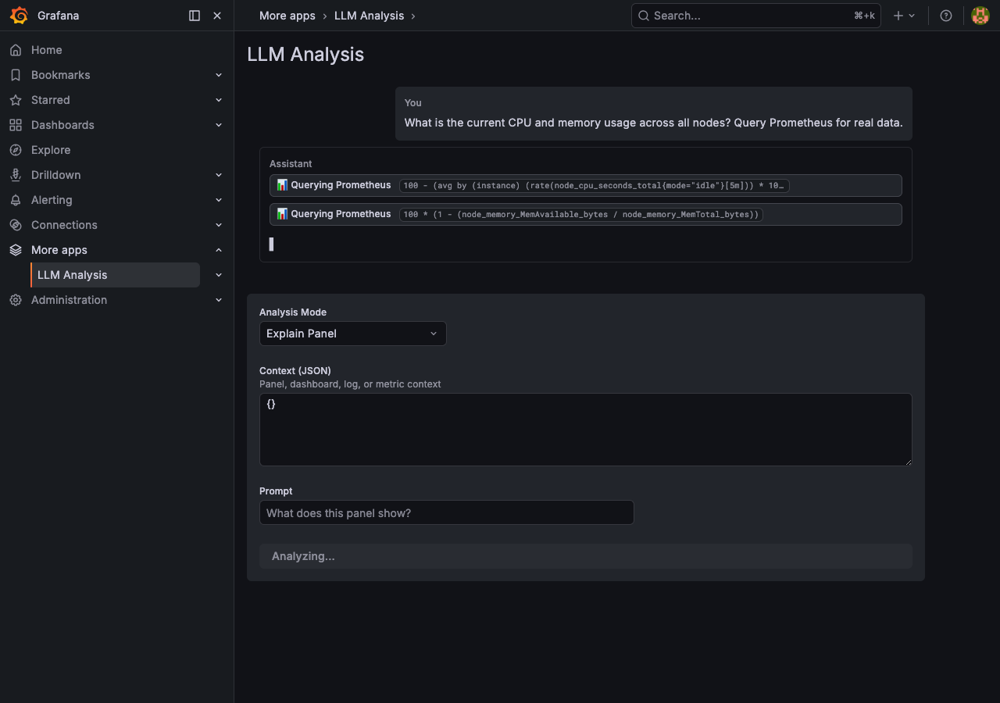
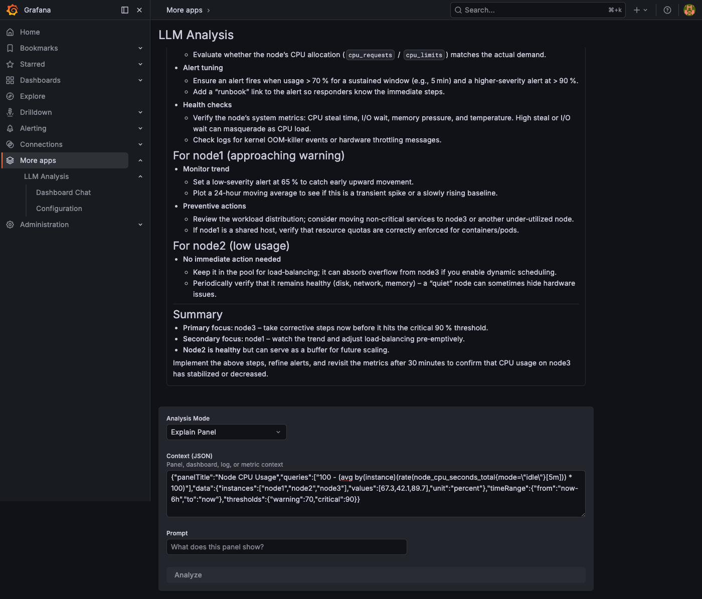
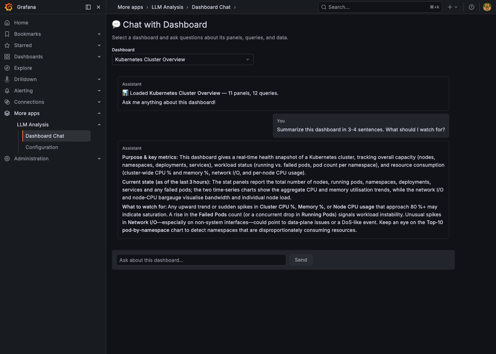

# Grafana LLM Analysis Plugin

A Grafana app plugin that wires OpenAI-compatible LLM endpoints into Grafana for
dashboard analysis, panel explanation, Prometheus metrics analysis, and Loki log
analysis.

## Features

- **Explain Panel** — Get AI-powered explanations of any panel's data
- **Summarize Dashboard** — Generate dashboard-level summaries
- **Analyze Logs** — Ask questions about Loki log data
- **Analyze Metrics** — Ask questions about Prometheus metrics
- **Chat with Dashboard** — Select any dashboard and have a conversation about its panels, queries, and data
- **Live Data Querying** — LLM automatically queries Prometheus and Loki datasources for real-time data via tool calling
- **Markdown Rendering** — LLM responses render with full markdown: headers, tables, code blocks, lists, and HTML
- **Streaming Responses** — Real-time streaming from LLM with typing indicator
- **Panel Menu Integration** — "Analyze with LLM" available directly from any panel's context menu
- **Any OpenAI-compatible API** — Works with OpenAI, Azure OpenAI, Ollama, vLLM,
  LiteLLM, IONOS AI Model Hub, and more

### Tool Calling — Live Prometheus Queries

The LLM automatically queries your datasources for real data. Tool call badges show the PromQL being executed in real-time:



### LLM Analysis — Real Data Analysis

Get structured analysis with actual metrics, actionable recommendations, and markdown-formatted tables:



### Chat with Dashboard

Select any dashboard and ask questions — the plugin automatically extracts all panels, queries, and metadata:



## Requirements

- Grafana ≥ 10.0.0
- An OpenAI-compatible LLM endpoint

## Installation

### From source

```bash
# Clone the repository
git clone https://github.com/tamcore/grafana-llm.git
cd grafana-llm

# Install frontend dependencies and build
npm install
npm run build

# Build the Go backend
go build -o dist/gpx_llmanalysis ./pkg/

# Copy dist/ to your Grafana plugins directory
cp -r dist/ /var/lib/grafana/plugins/tamcore-llmanalysis-app/
```

### Docker (development)

```bash
npm install
npm run build
go build -o dist/gpx_llmanalysis ./pkg/
docker compose up
```

Then open Grafana at http://localhost:3000 (admin/admin).

## Configuration

1. Go to **Administration → Plugins → LLM Analysis**
2. Click **Configuration**
3. Set:
   - **Endpoint URL** — Base URL of your LLM API (e.g., `https://openai.inference.de-txl.ionos.com/v1`)
   - **Model** — Model name (e.g., `openai/gpt-oss-120b`)
   - **API Key** — Your API key (stored securely)
   - **Timeout** — Request timeout in seconds (default: 60)
   - **Max Tokens** — Maximum response tokens (default: 4096)
   - **Grafana Service Account Token** _(optional)_ — A Viewer-role SA token for querying datasources via tool calling
4. Click **Test Connection** to verify
5. Click **Save settings**

## Supported Providers

| Provider           | Base URL Example                                      | Auth        |
| ------------------ | ----------------------------------------------------- | ----------- |
| IONOS AI Model Hub | `https://openai.inference.de-txl.ionos.com/v1`        | Bearer      |
| OpenAI             | `https://api.openai.com/v1`                           | Bearer      |
| Azure OpenAI       | `https://{resource}.openai.azure.com/openai/...`      | API key     |
| Ollama             | `http://localhost:11434/v1`                            | None        |
| vLLM               | `http://localhost:8000/v1`                             | Bearer      |
| LiteLLM            | `http://localhost:4000/v1`                             | Bearer      |

## Usage

1. Navigate to **LLM Analysis** in the Grafana sidebar
2. Select an **Analysis Mode**
3. Paste context JSON (panel data, dashboard metadata, logs, or metrics)
4. Type your question in the **Prompt** field
5. Click **Analyze**

## API Endpoints

| Endpoint           | Method | Description                          |
| ------------------ | ------ | ------------------------------------ |
| `/resources/health`| GET    | Test LLM endpoint connectivity       |
| `/resources/chat`  | POST   | Non-streaming chat completion         |
| `/resources/chat/stream` | POST | Streaming chat completion (SSE) |

## Development

```bash
# Frontend development (watch mode)
npm run dev

# Run frontend tests
npm test

# Run Go tests
go test ./pkg/... -v

# Quality gates
go fmt ./...
go vet ./...
golangci-lint run ./...
```

## Metrics

The plugin exposes Prometheus metrics:

- `grafana_llm_requests_total{model, status}` — Request counter
- `grafana_llm_request_duration_seconds{model}` — Request latency histogram
- `grafana_llm_tokens_used_total{model, direction}` — Token usage counter

## Architecture

```
├── pkg/                    # Go backend
│   ├── main.go             # Plugin entry point
│   └── plugin/
│       ├── app.go          # Plugin instance and settings
│       ├── health.go       # Health check endpoint
│       ├── resources.go    # HTTP resource routing
│       ├── llm.go          # OpenAI-compatible client
│       ├── streaming.go    # SSE streaming with tool-calling loop
│       ├── tools.go        # Tool definitions (Prometheus, Loki, datasources)
│       ├── tool_executor.go # Tool execution via Grafana datasource proxy
│       ├── security.go     # Input sanitization
│       └── metrics.go      # Prometheus metrics
├── src/                    # React frontend
│   ├── module.tsx           # Plugin entry point
│   ├── api/                # Backend API client
│   ├── context/            # Context builder and types
│   ├── components/         # UI components
│   └── pages/              # Plugin pages
├── docs/                   # Specification and docs
└── docker-compose.yaml     # Dev environment
```

## License

Apache License 2.0
